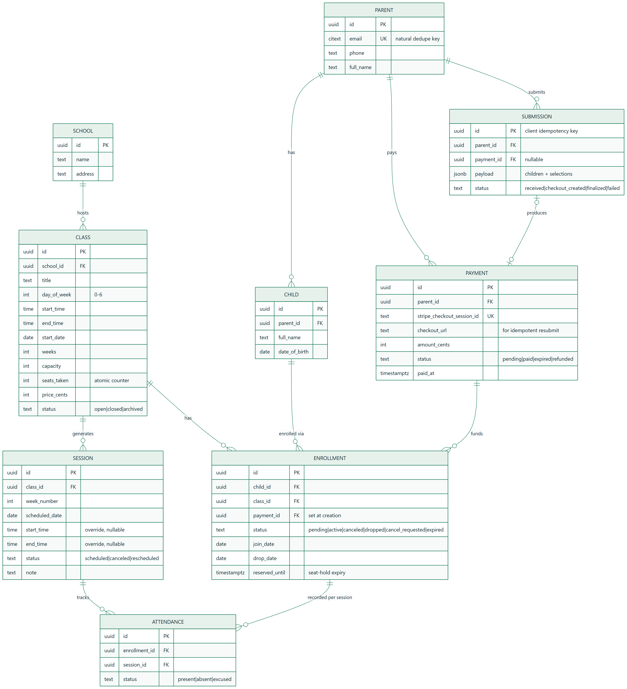

# Data Model & ERD — Keiki Coders Registration System

**Author:** Shawn Rasid L. Druz Ali
**Scope:** Parent registration system for after-school classes (take-home demo)
**Last updated:** September 2026

---

> **Rule:** The schema must anticipate the tricky cases (mid-semester joins, per-session cancellations, multi-child atomic submissions, idempotent finalization) up front — not bolt them on. Every non-obvious modeling choice is justified in Section 3.

## Table of Contents

1. [Entity-Relationship Diagram](#1-entity-relationship-diagram)
2. [Entities & Fields](#2-entities--fields)
3. [Modeling Decisions & Rationale](#3-modeling-decisions--rationale)
4. [Postgres DDL](#4-postgres-ddl)
5. [Lifecycle State Machines](#5-lifecycle-state-machines)

---

## 1. Entity-Relationship Diagram



<details><summary>Mermaid source</summary>

```mermaid
erDiagram
    SCHOOL ||--o{ CLASS : "hosts"
    CLASS ||--o{ SESSION : "generates"
    CLASS ||--o{ ENROLLMENT : "has"
    PARENT ||--o{ CHILD : "has"
    CHILD ||--o{ ENROLLMENT : "enrolled via"
    PARENT ||--o{ PAYMENT : "pays"
    PAYMENT ||--o{ ENROLLMENT : "funds"
    PARENT ||--o{ SUBMISSION : "submits"
    SUBMISSION |o--o| PAYMENT : "produces"
    ENROLLMENT ||--o{ ATTENDANCE : "recorded per session"
    SESSION ||--o{ ATTENDANCE : "tracks"

    SCHOOL {
        uuid id PK
        text name
        text address
        timestamptz created_at
    }
    CLASS {
        uuid id PK
        uuid school_id FK
        text title
        int day_of_week "0-6"
        time start_time
        time end_time
        date start_date
        int weeks
        int capacity
        int seats_taken "atomic counter"
        int price_cents
        text currency
        text status "open|closed|archived"
        timestamptz created_at
    }
    SESSION {
        uuid id PK
        uuid class_id FK
        int week_number
        date scheduled_date
        time start_time "override, nullable"
        time end_time "override, nullable"
        text status "scheduled|canceled|rescheduled"
        text note
        timestamptz created_at
    }
    PARENT {
        uuid id PK
        citext email UK "natural dedupe key"
        text phone
        text full_name
        timestamptz created_at
    }
    CHILD {
        uuid id PK
        uuid parent_id FK
        text full_name
        date date_of_birth
        text notes
        timestamptz created_at
    }
    ENROLLMENT {
        uuid id PK
        uuid child_id FK
        uuid class_id FK
        uuid payment_id FK "set at creation - webhook join path"
        text status "pending|active|canceled|dropped|cancel_requested|expired"
        date join_date
        date drop_date "nullable"
        timestamptz reserved_until "seat-hold expiry"
        timestamptz created_at
    }
    PAYMENT {
        uuid id PK
        uuid parent_id FK
        text stripe_checkout_session_id UK
        text stripe_payment_intent_id
        text checkout_url "for idempotent resubmit"
        int amount_cents
        text currency
        text status "pending|paid|expired|refunded"
        timestamptz created_at
        timestamptz paid_at
    }
    SUBMISSION {
        uuid id PK "client-generated idempotency key"
        uuid parent_id FK
        uuid payment_id FK "nullable"
        jsonb payload "children + class selections"
        text status "received|checkout_created|finalized|failed"
        timestamptz created_at
    }
    ATTENDANCE {
        uuid id PK
        uuid enrollment_id FK
        uuid session_id FK
        text status "present|absent|excused"
        timestamptz created_at
    }
```

</details>

---

## 2. Entities & Fields

| Entity | Purpose | Key relationships |
|---|---|---|
| **School** | Campus hosting classes | has many Class |
| **Class** | A recurring course (e.g. "Tuesdays 3–4pm, 10 weeks"). Owns the atomic `seats_taken` counter. | belongs to School; has many Session, Enrollment |
| **Session** | One meeting instance ("Week 3, Sep 22"). Materialized as rows, **not** computed from the recurrence rule. | belongs to Class; has many Attendance |
| **Parent** | Account holder. `email` (citext, unique) is the natural dedupe key. | has many Child, Payment, Submission |
| **Child** | A kid. Can be enrolled in multiple classes. | belongs to Parent; has many Enrollment |
| **Enrollment** | The Child↔Class join. Carries lifecycle status, join/drop dates, seat-hold expiry, and the funding Payment. | belongs to Child, Class, Payment |
| **Payment** | One Stripe checkout. **Can fund multiple enrollments** (multi-child submission). Stores `checkout_url` so a duplicate submission can return it. | belongs to Parent; funds many Enrollment |
| **Submission** | The idempotency + audit record for one parent form submission. PK = client-generated UUID. `payment_id` linked as soon as the checkout is created. | belongs to Parent; produces one Payment |
| **Attendance** | Per-session presence per enrollment. In v1 schema-only (UI punted). | belongs to Enrollment, Session |

---

## 3. Modeling Decisions & Rationale

These are the positions the brief explicitly asks the candidate to take (§4 open questions).

### 3.1 — Session is its own entity, not a computed recurrence

A `Class` stores the recurrence rule (`day_of_week`, `start_time`, `start_date`, `weeks`). But individual meetings **can be canceled for holidays or rescheduled** independently. If sessions were computed on the fly from the rule, there'd be nowhere to record "Week 4 is canceled" or "Week 7 moved to Thursday." So Sessions are **materialized rows** at class creation. `SESSION.status` + nullable time overrides capture per-meeting exceptions without touching the parent Class.

### 3.2 — One Stripe checkout funds multiple enrollments

The brief asks "what if they register two kids in the same submission." A single parent submission with N (child × class) selections creates **one** `Payment` and **N** `Enrollment` rows all pointing at it. Rationale: one card charge, one receipt, one atomic all-or-nothing unit. `PAYMENT.amount_cents` = sum of the selected class prices. This avoids N separate Stripe redirects and makes the submission a single transactional boundary.

### 3.3 — Parent dedupe on normalized email

`PARENT.email` is `citext` with a unique constraint = case-insensitive natural key. On submission we `SELECT ... WHERE email = $1`; hit → reuse the Parent, miss → create. **Known limitation (documented, not solved in v1):** two distinct families sharing one email collapse into one Parent. Acceptable for v1 (rare, recoverable); a v2 fix is a verified-account model. Phone captured as a secondary signal, not a unique key (families share numbers more often than emails).

### 3.4 — Cancellation is a *request*, not a delete

The brief says parents "**request** a cancellation." Modeled as a status transition (`active → cancel_requested`), never a row delete. Staff approve → `canceled` + seat released. Preserves history and payment linkage for refund/audit later.

### 3.5 — Mid-semester join pricing punted to v2, but not blocked

`ENROLLMENT.join_date` exists from day one. v1 charges **full price** regardless of join date (simple, honest). Proration is a pure pricing-function change in v2 — the schema already has the join date it needs, so v2 is not blocked. This is a deliberate scope cut, not an oversight.

### 3.6 — Seat accounting: counter on Class + hold on Enrollment

`CLASS.seats_taken` is a single integer mutated atomically (see §5 / PRD §5.6). `ENROLLMENT.reserved_until` is a short-lived seat hold created **before** Stripe redirect. Seat is reserved on Enrollment creation, confirmed on webhook, released on expiry/cancel/drop.

**Hold vs. checkout expiry alignment (critical):** Stripe's minimum Checkout Session `expires_at` is 30 minutes. The hold is therefore **35 minutes** — the hold must outlive the checkout, or a slow payer pays into a released seat. Release paths:
- `checkout.session.expired` webhook → release the holds (primary signal).
- **Lazy expiry** as backstop (no background sweeper — one less moving part): expired holds are released opportunistically at the start of any seat-claim transaction for that class.
- Late `checkout.session.completed` after a release (belt-and-braces): finalize attempts an **atomic re-claim** of the seat; if the class refilled, auto-refund the payment and notify. Fail-safe — money is never kept without a seat.

**Release is a guarded transition, never a bare decrement** (double-release-proof): flip the row's status first with a status guard, and only decrement for rows that actually transitioned — same transaction. SQL in §4.

### 3.8 — payment_id set at enrollment creation

Enrollments link `payment_id` **at creation**, not at finalization. The pending Payment row is created in the same transaction, so there is nothing to wait for — and the webhook needs this join path (`stripe_checkout_session_id → payment → enrollments`) to find what to finalize. A null-until-paid link would leave the webhook handler with no way to locate the pending rows.

### 3.7 — Submission as the idempotency anchor

`SUBMISSION.id` = client-generated UUID sent with the form. A double-click / resubmit carries the **same** UUID → `INSERT ... ON CONFLICT (id) DO NOTHING RETURNING id`; no row returned means the submission already exists. The retry then branches on the existing row's status:
- `checkout_created` → return the stored `payment.checkout_url` (that's why the URL is persisted). No new charge.
- `received` (first attempt died before checkout creation) → **resume**: the handler re-runs the remaining steps under the same submission id, not a no-op — otherwise the parent would be stuck with a dead submission and leaked holds.
- `finalized` → return "already registered."

This is the natural key that makes the whole flow idempotent end-to-end.

---

## 4. Postgres DDL

```sql
CREATE EXTENSION IF NOT EXISTS citext;
CREATE EXTENSION IF NOT EXISTS pgcrypto;  -- gen_random_uuid()

CREATE TABLE school (
  id          uuid PRIMARY KEY DEFAULT gen_random_uuid(),
  name        text NOT NULL,
  address     text,
  created_at  timestamptz NOT NULL DEFAULT now()
);

CREATE TABLE class (
  id           uuid PRIMARY KEY DEFAULT gen_random_uuid(),
  school_id    uuid NOT NULL REFERENCES school(id),
  title        text NOT NULL,
  day_of_week  smallint NOT NULL CHECK (day_of_week BETWEEN 0 AND 6),
  start_time   time NOT NULL,
  end_time     time NOT NULL,
  start_date   date NOT NULL,
  weeks        smallint NOT NULL CHECK (weeks > 0),
  capacity     int NOT NULL CHECK (capacity >= 0),
  seats_taken  int NOT NULL DEFAULT 0 CHECK (seats_taken >= 0),
  price_cents  int NOT NULL CHECK (price_cents >= 0),
  currency     text NOT NULL DEFAULT 'usd',
  status       text NOT NULL DEFAULT 'open'
                 CHECK (status IN ('open','closed','archived')),
  created_at   timestamptz NOT NULL DEFAULT now(),
  CONSTRAINT seats_within_capacity CHECK (seats_taken <= capacity)
);

CREATE TABLE session (
  id             uuid PRIMARY KEY DEFAULT gen_random_uuid(),
  class_id       uuid NOT NULL REFERENCES class(id) ON DELETE CASCADE,
  week_number    smallint NOT NULL,
  scheduled_date date NOT NULL,
  start_time     time,   -- override, else inherit class
  end_time       time,
  status         text NOT NULL DEFAULT 'scheduled'
                   CHECK (status IN ('scheduled','canceled','rescheduled')),
  note           text,
  created_at     timestamptz NOT NULL DEFAULT now(),
  UNIQUE (class_id, week_number)
);

CREATE TABLE parent (
  id          uuid PRIMARY KEY DEFAULT gen_random_uuid(),
  email       citext NOT NULL UNIQUE,          -- natural dedupe key
  phone       text,
  full_name   text NOT NULL,
  created_at  timestamptz NOT NULL DEFAULT now()
);

CREATE TABLE child (
  id             uuid PRIMARY KEY DEFAULT gen_random_uuid(),
  parent_id      uuid NOT NULL REFERENCES parent(id) ON DELETE CASCADE,
  full_name      text NOT NULL,
  date_of_birth  date,
  notes          text,
  created_at     timestamptz NOT NULL DEFAULT now()
);

CREATE TABLE payment (
  id                          uuid PRIMARY KEY DEFAULT gen_random_uuid(),
  parent_id                   uuid NOT NULL REFERENCES parent(id),
  stripe_checkout_session_id  text UNIQUE,
  stripe_payment_intent_id    text,
  checkout_url                text,            -- returned on idempotent resubmit
  amount_cents                int NOT NULL,
  currency                    text NOT NULL DEFAULT 'usd',
  status                      text NOT NULL DEFAULT 'pending'
                                CHECK (status IN ('pending','paid','expired','refunded')),
  created_at                  timestamptz NOT NULL DEFAULT now(),
  paid_at                     timestamptz
);

CREATE TABLE submission (
  id          uuid PRIMARY KEY,               -- client-generated idempotency key
  parent_id   uuid NOT NULL REFERENCES parent(id),  -- parent upserted before this insert
  payment_id  uuid REFERENCES payment(id),
  payload     jsonb NOT NULL,
  status      text NOT NULL DEFAULT 'received'
                CHECK (status IN ('received','checkout_created','finalized','failed')),
  created_at  timestamptz NOT NULL DEFAULT now()
);

CREATE TABLE enrollment (
  id             uuid PRIMARY KEY DEFAULT gen_random_uuid(),
  child_id       uuid NOT NULL REFERENCES child(id),
  class_id       uuid NOT NULL REFERENCES class(id),
  payment_id     uuid REFERENCES payment(id),  -- set at creation: webhook join path
  status         text NOT NULL DEFAULT 'pending'
                   CHECK (status IN ('pending','active','canceled','dropped','cancel_requested','expired')),
  join_date      date,
  drop_date      date,
  reserved_until timestamptz,                  -- seat-hold expiry (35 min; > Stripe's 30-min checkout expiry)
  created_at     timestamptz NOT NULL DEFAULT now()
);

-- One LIVE enrollment per child per class; canceled/dropped/expired rows
-- don't block re-enrollment (kids drop and rejoin mid-semester).
CREATE UNIQUE INDEX uniq_live_enrollment
  ON enrollment(child_id, class_id)
  WHERE status IN ('pending','active','cancel_requested');

CREATE TABLE attendance (
  id            uuid PRIMARY KEY DEFAULT gen_random_uuid(),
  enrollment_id uuid NOT NULL REFERENCES enrollment(id) ON DELETE CASCADE,
  session_id    uuid NOT NULL REFERENCES session(id) ON DELETE CASCADE,
  status        text NOT NULL DEFAULT 'present'
                  CHECK (status IN ('present','absent','excused')),
  created_at    timestamptz NOT NULL DEFAULT now(),
  UNIQUE (enrollment_id, session_id)
);

-- Hot-path indexes
CREATE INDEX idx_class_school       ON class(school_id);
CREATE INDEX idx_session_class      ON session(class_id);
CREATE INDEX idx_child_parent       ON child(parent_id);
CREATE INDEX idx_enrollment_class   ON enrollment(class_id);
CREATE INDEX idx_enrollment_child   ON enrollment(child_id);
CREATE INDEX idx_enrollment_hold    ON enrollment(reserved_until)
                                     WHERE status = 'pending' AND reserved_until IS NOT NULL;
```

### The atomic oversell-safe seat claim (the graded query)

```sql
-- Runs inside the registration transaction, once per child+class line item.
-- Fail-closed: if no row comes back, the class is full — abort the whole submission.
UPDATE class
   SET seats_taken = seats_taken + 1
 WHERE id = $1
   AND seats_taken < capacity
RETURNING seats_taken;
```

### Seat release — guarded transition, double-release-proof

Every release path (hold expiry, checkout expired, cancel approved, drop) uses the
same shape: flip status with a guard, decrement **only** for rows that actually
transitioned, same transaction. A racing webhook or a double-clicked approve can't
decrement twice — the second attempt matches zero rows.

```sql
BEGIN;
WITH released AS (
  UPDATE enrollment
     SET status = 'expired'                    -- or 'canceled' / 'dropped'
   WHERE id = ANY($1)
     AND status = 'pending'                    -- guard: only live transitions count
     AND reserved_until < now()
  RETURNING class_id
)
UPDATE class c
   SET seats_taken = seats_taken - r.n
  FROM (SELECT class_id, count(*) AS n FROM released GROUP BY class_id) r
 WHERE c.id = r.class_id;
COMMIT;
```

**No background sweeper in v1** — expired holds are released lazily: this release
runs at the start of any seat-claim transaction touching the class (and on the
`checkout.session.expired` webhook). One less scheduled job to build and demo.

### Late payment after release (fail-safe)

If `checkout.session.completed` arrives for enrollments already `expired` (slow
payer, seat possibly resold): finalize attempts an atomic **re-claim** (same claim
query). Success → flip back to `active`. Class full → mark payment for **refund**
and notify. Money is never kept without a seat.

Structurally identical to the DermaRoute atomic Gemini daily-budget cap
(`INSERT ... ON CONFLICT DO UPDATE ... RETURNING` on a shared counter, reserved
before each billable call, correct across concurrent serverless instances) —
cited as prior art in the Loom.

---

## 5. Lifecycle State Machines

**Enrollment**
```
                 seat claimed + checkout created
   (none) ─────────────────────────────────────▶ pending
                                                    │  webhook: payment paid
                                                    ▼
                                                  active
                            parent requests cancel │
                                                    ▼
                                            cancel_requested
                                    staff approve   │
                                                    ▼
                                                 canceled  (seat released)

   pending ──(hold expires / checkout.session.expired)──▶ expired (seat released, row kept for audit)
   expired ──(late webhook: paid + re-claim wins)───────▶ active
   expired ──(late webhook: class refilled)─────────────▶ stays expired, payment → refund
   active  ──(kid leaves mid-semester)──────────────────▶ dropped (drop_date set, seat released)
```

**Session**
```
   scheduled ──holiday──▶ canceled
   scheduled ──moved────▶ rescheduled (new date/time, note)
```

**Payment**
```
   pending ──checkout.session.completed──▶ paid
   pending ──checkout.session.expired───▶ expired (holds released)
   paid    ──late-payment reclaim lost──▶ refunded (auto, fail-safe)
   paid    ──staff refund───────────────▶ refunded (manual, v2)
```
_Note: failed card attempts keep a Checkout Session open — there is no single
"payment failed" webhook to act on. `checkout.session.expired` is the terminal
give-up signal; until then the hold simply runs out._

---

*This document is a living reference. Update it when the schema or a modeling position changes.*
